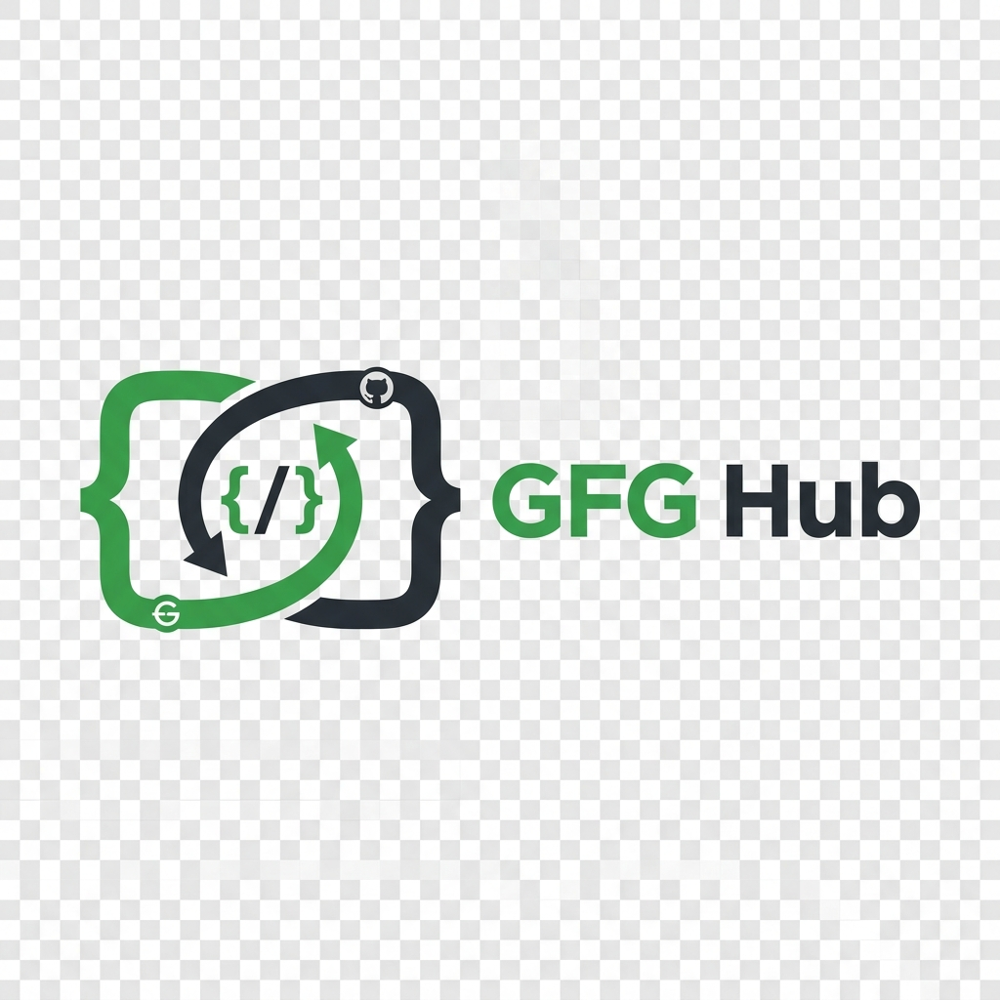

  
   
  
  <h1>GFG Hub</h1>
  
<b>Automatically sync your accepted GeeksforGeeks submissions to GitHub.</b>

  
  
  

---

## 🚀 What is GFG Hub?

GFG Hub is a powerful, lightweight Chrome Extension designed for competitive programmers and software engineers. It automatically captures your successful code submissions on **GeeksforGeeks** and securely pushes them to your linked GitHub repository.

No more manual copying and pasting! Build your coding portfolio effortlessly while you practice.

### ✨ Features
- **Automatic Sync**: Instantly pushes your accepted solutions to GitHub.
- **Rich README Generation**: Captures the full problem statement (including images and constraints), topic tags, and your code—beautifully formatted using GitHub-flavored markdown.
- **Folder Organization**: Automatically organizes your repository into clean, intuitive folders for every problem.
- **100% Free & Secure**: Operates entirely client-side inside your browser. No backend servers, no hidden fees, and your GitHub Personal Access Token is stored securely in your local browser storage.
- **Non-blocking UI**: Features a sleek, non-intrusive on-screen toast notification system to let you know when your sync is successful.

---

## 🛠️ Installation & Setup

1. **Install the Extension**
   - *Currently in developer mode. (Chrome Web Store link coming soon!)*
   - Download this repository, go to `chrome://extensions/`, enable **Developer mode**, and select **Load unpacked** pointing to this folder.

2. **Connect to GitHub**
   - Click on the GFG Hub extension icon.
   - Click "Authenticate" and provide a **GitHub Personal Access Token (PAT)**. 
   - *Note: Make sure your PAT has the `repo` scope selected so it can create and write to repositories.*

3. **Link your Repository**
   - From the extension popup, either select an existing repository from the dropdown or create a brand new one directly from the UI.

4. **Start Coding!**
   - Solve a problem on GeeksforGeeks. Once you receive the **"Problem Solved Successfully"** verdict, GFG Hub handles the rest.

---

## 🔒 Privacy & Security

We believe your data belongs to you.
- **Zero Tracking**: GFG Hub does not use Google Analytics or any third-party tracking scripts.
- **Zero Servers**: We do not route your code or your credentials through any proxy servers. Everything is sent directly from your Chrome browser to the official GitHub API.

---

## 📄 License

This project is open-source and distributed under the **MIT License**. See the [LICENSE](LICENSE) file for more details.

  <i>Built with ❤️ for the developer community.</i>

